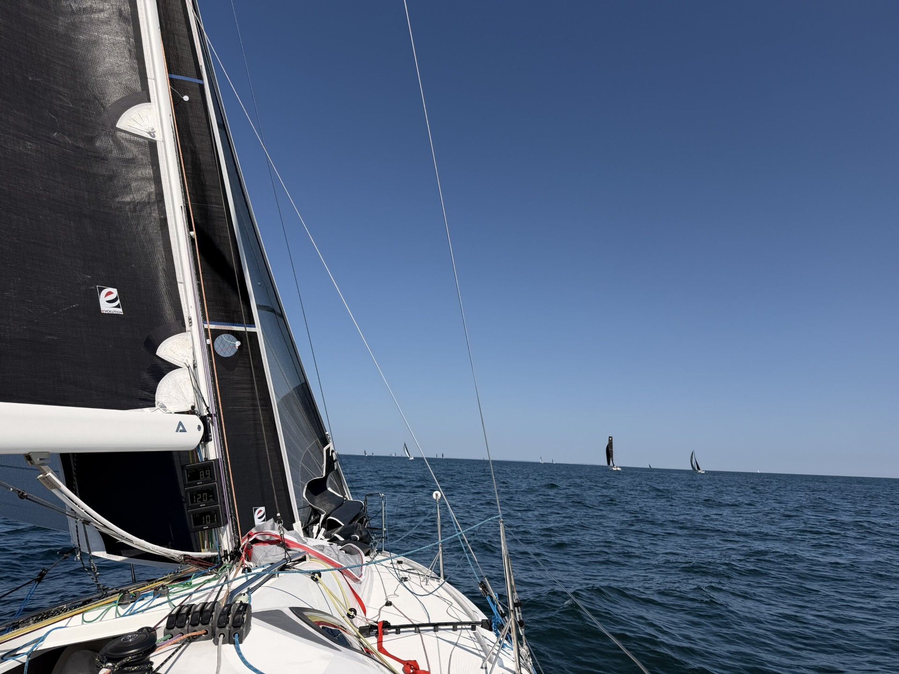
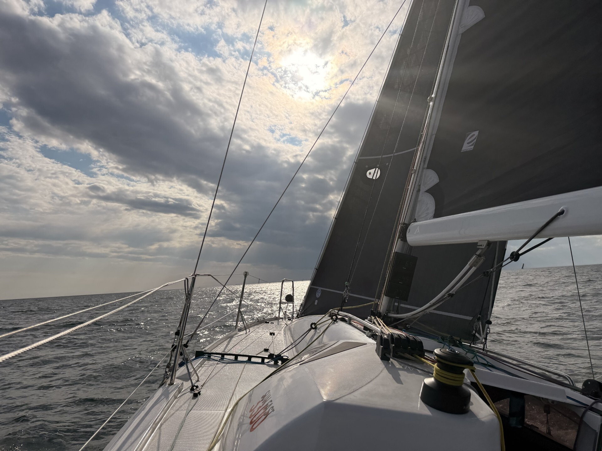
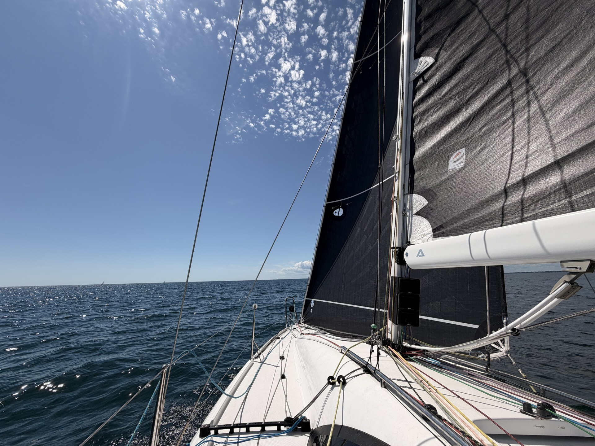

## Overview

The Ida Lewis Distance Race has always been one of my favorite regattas. It offers pretty much the best of New England sailing: a start on Narragansett Bay right off Newport, followed by roughly 24 hours of offshore racing through Rhode Island and Block Island Sound. The forecast promised sunshine, winds in the mid-teens, and some exciting racing conditions — interrupted, of course, by the occasional hole in the breeze. Because apparently it wouldn't be an offshore race without spending at least some time staring at completely motionless telltales.

This year certainly delivered.

## The Start

Steve Fisk and I started with a light northerly behind us and quickly hoisted the A2. Naturally, almost as soon as we had committed to the kite, the southerly sea breeze began to make its appearance. We held on for a while, but about halfway between Newport and the first mark, Mo(A), it was finally time to switch to the jib.

## Mo(A) to Buzzards Bay Light Tower

Around Mo(A), we turned east toward Buzzards Bay Light Tower and hoisted the Code 0. The sea breeze settled in nicely and gave us some excellent reaching conditions — exactly the kind of sailing the Sun Fast 3300 loves.

At Buzzards Bay Light Tower, it was time to change gears again. The reach became a beat in 12–15 knots, a wind range where the Sun Fast 3300 really comes alive upwind.

## The Beat to Montauk

Our next mark was about 40 miles away off Montauk. We chose to sail down the eastern side of Block Island. It looked like the more direct route, and I was concerned about patchy wind north of the island. A good number of our competitors chose the western side instead.

For quite a while, our decision looked excellent. We led the fleet until around midnight.

## The Midnight Hole

And then somebody apparently found the wind's OFF switch.

The breeze became increasingly shifty before disappearing altogether. There we were, sitting in a giant hole in the middle of the night while the rest of the fleet slowly began creeping back toward us. Few things in sailboat racing are quite as enjoyable as watching a hard-earned lead evaporate at 0.0 knots.

Time for the secret weapon: the wind seeker.

The wind seeker is a fully battened foresail designed to maintain some airflow in extremely light conditions. In theory, perfect. In practice, there was one minor problem: it wasn't rigged.

Four battens. In the middle of the night. While parked.

By the time we finally had the sail ready, the wind had returned from the north. So after all that effort, the wind seeker never even made it up. We abandoned the project, hoisted the A2, and headed toward the mark.

Then came another lesson in nighttime offshore racing: don't douse too early.

Unfortunately, we did exactly that. Combined with adverse current, the premature douse turned the rounding into a painful exercise and cost us more distance. Several competitors were now ahead, and our comfortable lead had officially become a recovery mission.

## The Recovery

The next 45 miles took us along the southern edge of the newly introduced exclusion zone under Code 0. The northerly had stabilized, and Stratos was moving well, reaching speeds of up to 10 knots. Slowly, we began clawing back some of the distance we had given away.

## Saturday Morning — Parking, Round 2

By Saturday morning, as the sun came up near the eastern corner of the exclusion zone, the wind began to veer and — because one parking lot apparently wasn't enough for this race — its velocity dropped significantly.

Heading north toward Buzzards Bay Light Tower, we parked again.

This time, however, we were ready.

When the wind returned from the east, out came the wind seeker. After its unsuccessful midnight audition, it finally got its moment on stage. And it worked brilliantly. Stratos made about 3 knots of boat speed in only 3 knots of wind. While other boats struggled in the light air, we were moving again and gaining back more distance on the leaders.

## The Finish

From Buzzards Bay Light Tower, we sailed the next 16 miles back toward Mo(A) under jib. Around Mo(A), there was time for one final A2 hoist and the run back into Newport.

We crossed the finish line late Saturday afternoon in 4th place, after roughly 29 hours on the water.

Not quite the result we had hoped for after leading the fleet — but after two major parking sessions, a premature douse, and one midnight wind-seeker assembly workshop, we'll take it.

## What Worked / What Didn't

**1. At night, slow the brain down before trying to make the boat go faster.**

Fatigue does strange things to decision-making. When tired, establish the plan, double-check it, and only then execute. A tired brain can turn perfectly manageable situations into expensive mistakes very quickly.

I had gone through almost exactly the same experience four weeks earlier in the Offshore 160, where unforced errors in the middle of the night took us from the lead to the back of the fleet. Apparently one lesson wasn't enough. Lack of sleep and unbearable heat certainly didn't help, but ultimately the lesson is simple: when tired, be deliberate.

**2. Rig the wind seeker before you actually need the wind seeker.**

The sail has four battens and takes too long to assemble when the boat is already parked and every minute matters. Next time, it will be fully rigged ahead of time and laid out flat in the cabin, ready to go.

It may be a sail we rarely use, but Saturday morning proved why it deserves a place onboard. In the right conditions, it can make a huge difference. Especially when everyone else is busy admiring the scenery at zero knots.
